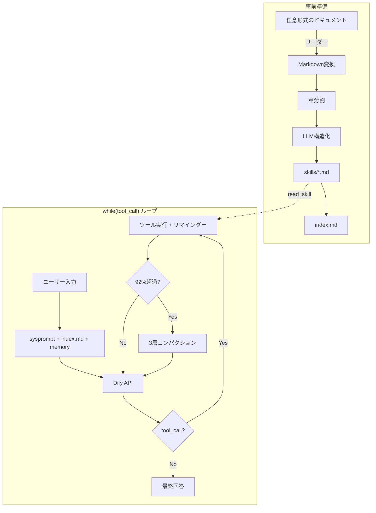

# Dify ナレッジエージェント 要件定義

## 1. プロジェクト概要

大規模な技術ドキュメント群をナレッジとして取り込み、
自然言語の質問・指示に対して自律的に検索・解析・ドキュメント生成を行う
ローカルPythonエージェント。

LLM推論のみDify Cloud APIを使用し、それ以外の処理は全てローカルで実行する。
エージェントのコアアルゴリズムはClaude Codeの設計に準拠する。

## 2. 設計原則

Claude Codeの設計思想をそのまま採用する。

> **"The agent is the model. The code is the harness."**

エージェントの知性はLLMそのものであり、
ローカルPythonコードはLLMに「手・目・作業場」を与えるハーネスに徹する。
ハーネスの設計に注力し、LLMの判断を信頼する。

| 原則 | 内容 |
|------|------|
| 単一ループ | `while(tool_call)` の1ループですべてを処理。マルチエージェント不要 |
| ツールが主役 | ツールなしのLLMはテキストを返すだけ。ツールがLLMをエージェントにする |
| LLMが判断 | 何を検索するか、十分か、次に何をするか、すべてLLMが決める |
| ハーネスはシンプル | 分岐ロジック・ルーティング・ワークフロー定義をコード側に持たない |

## 3. コアアーキテクチャ

### 3.1: エージェントループ

Claude Codeと同一の `while(tool_call)` パターン。

```python
def agent_loop(user_input: str):
    messages = build_initial_messages(user_input)

    for turn in range(MAX_TURNS):
        # コンパクション判定（92%で自動発火）
        if token_usage(messages) > CONTEXT_LIMIT * 0.92:
            messages = compact(messages)

        # LLM呼び出し
        response = dify_chat(messages, tools=TOOL_DEFINITIONS)

        # ツール呼び出しなし = 最終回答。ループ自然終了
        if not response.has_tool_calls:
            return response.answer

        # ツール実行 → 結果+リマインダーをメッセージに追加
        for call in response.tool_calls:
            result = execute_tool(call.name, call.args)
            messages.append({
                "role": "tool",
                "content": result + TOOL_REMINDERS.get(call.name, "")
            })
```

ポイント:
- 明示的な「停止ツール」は不要。LLMがテキストのみ返せば終了
- ツール結果にリマインダー（固定テキスト指示）を付与し、LLMの遵守率を上げる
- コンパクションはループ内で自動判定

### 3.2: ツール一覧

LLMが自由に組み合わせて呼び出す。全てローカルPythonで実行。

**ナレッジ検索:**

| ツール | 引数 | 動作 |
|--------|------|------|
| `list_skills` | scope?: str | 利用可能なスキルファイルの一覧と概要を返す（本文は含まない） |
| `skill_search` | query: str | index.mdの内容から、質問に関連するスキルを推薦する |
| `read_skill` | path: str | 指定スキルファイルの全文を返す（オンデマンドロード） |
| `keyword_search` | pattern: str, scope?: str | 全スキルファイルをgrep検索。正規表現対応。前後N行の文脈付きで返す |

**コード解析:**

| ツール | 引数 | 動作 |
|--------|------|------|
| `scan_project` | path: str | ディレクトリのファイル構成を返す |
| `read_source` | path: str, symbol?: str | ソースコードを読む。symbol指定時はその関数/クラスのみ |
| `grep_source` | pattern: str, path: str | ソースコードをgrep検索 |
| `extract_structure` | path: str | 関数/クラス/変数の一覧と呼び出し関係をJSONで返す |
| `static_analysis` | path: str, analysis: str | 指定した解析を実行し結果をJSONで返す（後述） |

**計画・管理:**

| ツール | 引数 | 動作 |
|--------|------|------|
| `todo_write` | todos: list | TODOリストの作成・更新。全体を毎回上書きする |
| `memory_write` | key: str, content: str | project_memory.mdにキー付きで学習を保存 |
| `memory_read` | key?: str | project_memory.mdから読み出す |

**出力:**

| ツール | 引数 | 動作 |
|--------|------|------|
| `write_file` | path: str, content: str | ファイルを書き出す（md, mermaid, json等） |

**コンテキスト管理:**

| ツール | 引数 | 動作 |
|--------|------|------|
| `compact_now` | — | 手動でコンパクションを発火 |
| `get_status` | — | 現在のトークン使用量・残りバジェット・TODOの状態を返す |

### 3.3: ツール結果リマインダー

Claude Codeの重要パターン。システムプロンプトに1回書くよりも、
ツール結果に毎回付与する方がLLMの遵守率が高い。

```python
TOOL_REMINDERS = {
    "read_skill":
        "[reminder] 情報が不十分ならkeyword_searchで詳細を探してください。",
    "keyword_search":
        "[reminder] 文脈が必要ならread_skillで全文を読んでください。",
    "todo_write":
        "[reminder] TODOリストの次のタスクに進んでください。",
    "scan_project":
        "[reminder] 重要なファイルをread_sourceやextract_structureで詳しく調べてください。",
    "extract_structure":
        "[reminder] 特定のシンボルを深堀りするにはread_sourceを使ってください。"
        " 静的解析が必要ならstatic_analysisも利用できます。",
    "static_analysis":
        "[reminder] 解析結果を解釈し、問題があればread_sourceで該当箇所を確認してください。",
}
```

### 3.4: スキルのオンデマンドロード

セッション開始時にはスキルの**説明のみ**をロードし、
本文はLLMが`read_skill`を呼んだ時に初めてロードする。
これによりコンテキストの無駄遣いを防ぐ。

```
セッション開始時にロードされるもの:
  - システムプロンプト（ツール定義含む）
  - skills/index.md（各スキルの名前と1行概要のみ）
  - project_memory.md（先頭25KB上限）

LLMが必要と判断した時にロードされるもの:
  - 個別のスキルファイル本文（read_skill経由）
  - ソースコード（read_source経由）
```

### 3.5: 3層コンパクション

```
Tier 1（毎ターン自動）: 古いツール結果をクリア
    → 直近5件のみ保持、それ以前は [cleared] に置換
    → LLM不使用、コストゼロ

Tier 2（Tier1で不足時）: ローカル圧縮
    → テーブル・装飾・空行を除去
    → 長いツール結果を先頭+末尾に切り詰め
    → LLM不使用

Tier 3（Tier2で不足時）: LLM要約 + コンテキスト再構成
    → LLMに構造化サマリーを生成させる
    → サマリー + 直近5結果 + index.md + TODO + project_memory.md で再構築
```

Tier 3のサマリープロンプト:
```
会話を要約してください。以下のセクションを含めてください:
1. セッションの目的
2. これまでに分かったこと
3. 参照したスキルファイルと重要な情報
4. 実行した解析とその結果
5. 生成したファイル
6. 未解決の問題
7. 次にやるべきこと
8. TODOリストの現在の状態
```

コンパクション後の再構成:
```python
def reconstruct(summary, messages):
    return [
        system("[context compacted]"),
        assistant(summary),
        *recent_tool_results(messages, n=5, max_tokens=50000),
        # index.md, TODO, project_memory.md はシステムプロンプト内で自動復元
    ]
```

### 3.6: 永続メモリ（project_memory.md）

CLAUDE.md相当。セッションを跨いで保持すべき情報を保存する。
コンパクションの影響を受けない（システムプロンプトの一部としてロードされるため）。

LLMが`memory_write`ツールで書き込み、セッション開始時に先頭25KBがロードされる。

## 4. 機能要件

### F1: ナレッジ取り込み（knowledge_to_skills）

任意形式のドキュメントをスキルファイルに変換する事前処理。

| 項目 | 内容 |
|------|------|
| 入力 | 任意のファイル/ディレクトリ |
| 出力 | skills/{doc_name}/ 配下にトピック単位.md + index.md |
| 処理 | ファイル読取 → Markdown変換 → 章分割 → LLM構造化 |

対応形式:

| 形式 | リーダー |
|------|---------|
| PDF | pymupdf4llm |
| Markdown | そのまま |
| テキスト | そのまま |
| HTML | BeautifulSoup → md |
| reStructuredText | docutils → md |
| Word (.docx) | python-docx → md |
| Excel/CSV | pandas → mdテーブル |
| ソースコード | そのまま + コメント抽出 |

処理フロー:
```
入力ファイル
  → 拡張子でリーダー選択 → Markdown変換
  → 章分割（H1/H2）
  → 小章統合（500文字未満）/ 大章分割（30000文字超）
  → [オプション] LLMで構造化
  → skills/{doc_name}/section.md として保存
  → index.md 生成（スキル名 + 1行概要）
```

### F2: 対話エージェント（agent）

セクション3.1のエージェントループそのもの。
LLMがツール群を自由に組み合わせ、検索・解析・検証を繰り返す。
何をどの順番でやるかは全てLLMが決める。
コード側にルーティングロジックや分岐は持たない。

### F3: コード解析

エージェントが`scan_project` / `read_source` / `extract_structure` / `grep_source` / `static_analysis`
ツールを使ってソースコードを解析し、ドキュメントを生成する。

解析ロジック自体はツールの実装（ローカルPython）に含まれ、
何をどの順番で解析するかはLLMが判断する。

#### extract_structure

コードの構造情報を抽出する。返すデータ例:
```json
{
  "functions": [
    {"name": "main", "file": "src/main.c", "line": 42,
     "calls": ["init", "run"], "called_by": []}
  ],
  "variables": [
    {"name": "g_buf", "type": "uint8_t[256]", "scope": "global",
     "qualifiers": ["volatile"],
     "written_by": ["irq_handler"], "read_by": ["process"]}
  ],
  "includes": {"src/main.c": ["config.h"]}
}
```

#### static_analysis

汎用静的解析ツール。`analysis`引数で解析の種類を指定する。
全てローカルPythonで実行（外部ツール不要）。
言語はファイル拡張子から自動判定する。

| analysis | 内容 | 返すデータ |
|----------|------|-----------|
| `call_graph` | 関数/メソッドの呼び出しグラフ | `{nodes: [{name, file, line}], edges: [{from, to}]}` |
| `dependency_graph` | ファイル/モジュール間の依存関係 | `{nodes: [file], edges: [{from, to, type}]}` |
| `data_flow` | 変数の定義→代入→参照の追跡 | `{variable, definitions: [], assignments: [], references: []}` |
| `control_flow` | 関数内の分岐・ループ構造 | `{function, blocks: [{type, line, children}]}` |
| `complexity` | 循環的複雑度・ネスト深度・関数長 | `{functions: [{name, cyclomatic, max_nesting, lines}]}` |
| `dead_code` | 未使用の関数・変数・import | `{unused_functions: [], unused_variables: [], unused_imports: []}` |
| `symbol_table` | スコープ付きシンボル一覧 | `{symbols: [{name, type, scope, file, line, qualifiers}]}` |
| `type_info` | 型情報・typedef/struct/enum定義 | `{types: [{name, kind, members, file, line}]}` |
| `metrics` | プロジェクト全体の統計情報 | `{total_files, total_lines, total_functions, languages, loc_by_file}` |
| `issues` | 潜在的問題の検出 | `{issues: [{severity, type, message, file, line}]}` |

`issues`が検出する問題の例:
- 未初期化変数の使用
- 到達不能コード
- 無限ループの可能性
- バッファサイズと操作の不整合
- リソースのopen後にcloseがないパス
- グローバル変数への非排他アクセス（マルチスレッド/割り込み）
- 型の暗黙変換による精度損失
- 再帰呼び出しの検出

実装方針:
- 正規表現 + AST解析のハイブリッド。言語ごとにパーサーを分ける
- C/C++: tree-sitter-c（利用可能な場合）またはマクロ展開なしの正規表現パース
- Python: ast標準ライブラリ
- JavaScript/TypeScript: tree-sitter-javascript または正規表現
- その他: 正規表現ベースの汎用パーサー（関数定義・呼び出しの検出のみ）

LLMはこれらのデータを見て、mermaid図やレポートを生成するか、
さらに詳しく調べるか、自分で判断する。

### F4: コンパクション

セクション3.5の3層コンパクションを実装する。

## 5. 非機能要件

| 項目 | 要件 |
|------|------|
| 実行環境 | ローカルPython 3.10+ |
| 外部通信 | Dify Cloud APIのみ |
| コンパクション閾値 | 92%（config.pyで変更可能） |
| ループ上限 | MAX_TURNS = 30（config.pyで変更可能） |
| 永続メモリ上限 | 先頭25KB |
| 依存ライブラリ | pymupdf4llm, requests, tiktoken, beautifulsoup4, python-docx, pandas, tree-sitter（オプション） |

## 6. Dify側の構成

Dify Cloud上に「チャットボット」アプリを作成し、APIキーを発行する。

- モデル: 任意（Claude / GPT-4o等）
- コンテキスト長: 最大に設定
- ナレッジ（RAG）: **使用しない**

Difyが function calling に対応している場合はネイティブ利用。
非対応の場合はLLMにXMLタグでツール呼び出しを出力させ、ローカルでパースする。

## 7. 処理フロー



## 8. ファイル構成

```
agent/
├── config.py                  # 設定
├── dify_client.py             # Dify APIクライアント
├── agent.py                   # while(tool_call) ループ
├── tool_registry.py           # ツール名→関数マッピング + スキーマ
├── tool_parser.py             # LLM出力からツール呼び出しをパース
├── compactor.py               # 3層コンパクション
├── system_prompt.py           # システムプロンプト動的生成
├── tools/
│   ├── search.py              # list_skills, skill_search, read_skill, keyword_search
│   ├── code.py                # scan_project, read_source, grep_source, extract_structure
│   ├── static_analysis.py     # static_analysis（解析種別ディスパッチ）
│   ├── parsers/               # 言語別パーサー（static_analysisが使用）
│   │   ├── c_parser.py        # C/C++（tree-sitter or 正規表現）
│   │   ├── python_parser.py   # Python（ast標準ライブラリ）
│   │   ├── js_parser.py       # JS/TS（tree-sitter or 正規表現）
│   │   └── generic_parser.py  # 汎用（正規表現ベース）
│   ├── planning.py            # todo_write, memory_write, memory_read
│   ├── output.py              # write_file
│   └── context.py             # compact_now, get_status
├── readers/
│   ├── pdf.py                 # pymupdf4llm
│   ├── markdown.py
│   ├── html.py
│   ├── docx.py
│   ├── csv.py
│   └── code.py
├── knowledge_to_skills.py     # ナレッジ取り込みCLI
├── skills/
│   ├── index.md
│   └── {doc_name}/*.md
├── project_memory.md
├── requirements.txt
└── README.md
```

## 9. Claude Codeからの採用パターン

| # | パターン | 実装 |
|---|---------|------|
| 1 | `while(tool_call)` | ツール呼び出しなし = 自然終了 |
| 2 | ツール結果リマインダー | tool_resultに固定テキスト付与 |
| 3 | オンデマンドロード | 概要のみ先行、本文はread_skill時 |
| 4 | TODOツール | 計画・進捗管理。全体上書き |
| 5 | 3層コンパクション | Tier1→Tier2→Tier3 |
| 6 | コンパクション後再構成 | サマリー + 直近5結果 + 永続情報 |
| 7 | 永続メモリ | project_memory.md |
| 8 | ツールレジストリ | JSON Schema + ディスパッチャ |
| 9 | ハーネス思想 | コードに分岐なし。LLMが全て判断 |

## 10. 未決事項

- **Difyのfunction calling対応**: ネイティブ対応ならそちらを使う。非対応ならXMLパース
- **MAX_TURNS vs コスト制限**: budget_usd制限も入れるか
- **keyword_searchのインデックス**: スキル数が少なければgrep、多ければ事前構築
- **サブエージェント**: まず単一ループで開始。必要になったら検討
- **コンパクション品質劣化**: 重要情報はmemory_writeで逃がす運用
- **tiktokenとClaudeのトークン差**: 安全マージン+10%
