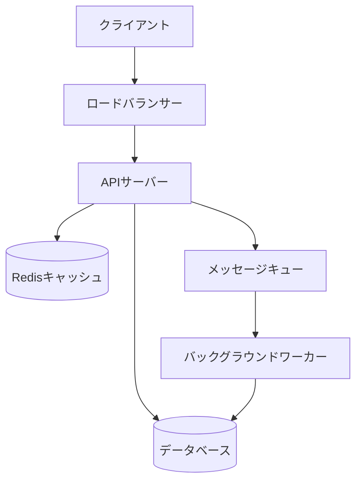

# Example System Architecture

<!-- サンプルナレッジファイル: アーキテクチャドキュメントから生成された例 -->

## システム概要

本システムは3層アーキテクチャで構成されます。

## コンポーネント構成

### APIサーバー

- 言語: Python 3.11
- フレームワーク: FastAPI
- デプロイ: Docker + Kubernetes
- スケール: オートスケーリング（CPU使用率70%で増設）

### データベース

- メインDB: PostgreSQL 15
- キャッシュ: Redis 7
- バックアップ: 日次スナップショット（S3保存）

### メッセージキュー

- ブローカー: RabbitMQ
- 用途: 非同期タスク処理、メール送信、レポート生成

## データフロー

1. クライアントからのリクエストをロードバランサーが受信
2. APIサーバーが認証・バリデーションを実施
3. キャッシュヒット時はRedisから即時返答
4. キャッシュミス時はPostgreSQLから取得後キャッシュに保存
5. 重い処理はメッセージキューに投入し即時レスポンス
6. ワーカーが非同期で処理完了後にWebhookで通知

## 環境構成

| 環境 | 用途 | スペック |
|------|------|---------|
| development | 開発者ローカル | Docker Compose |
| staging | 結合テスト | 本番の1/4スペック |
| production | 本番 | 高可用性クラスター |
